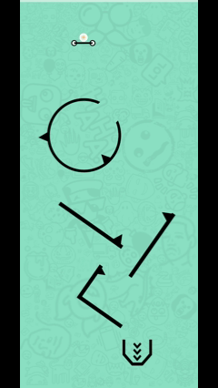
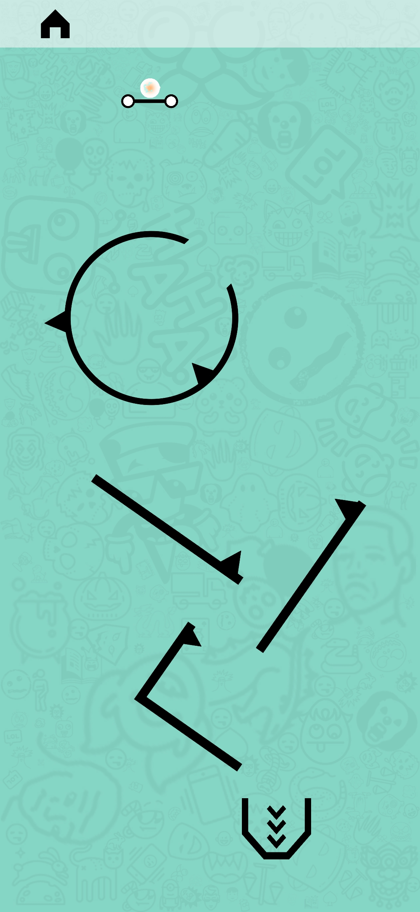

# 🏃 EscapeBall 2D

## 📂 Project Overview
**EscapeBall 2D** is a vertical runner game developed in **2022**. The project focuses on `Rigidbody2D` interactions and gravity-based movement mechanics.

The objective is to navigate a falling ball through rotating geometric obstacles by controlling the jump timing.

## ⚙️ Mechanics
* **Gravity Control:** Constant vertical acceleration.
* **Input Handling:** Tap-to-jump logic applying upward force.
* **Collision Detection:** Interaction with rotating static and dynamic obstacles.

## 📸 Gallery

  
  

  
  
  

## 🎮 Gameplay Video
Click the image below to watch the gameplay:

## 📅 Project Info
* **Stack:** Unity 2D, C#
* **Note:** This project serves as an archive of my earlier work with Unity physics engine.

---
